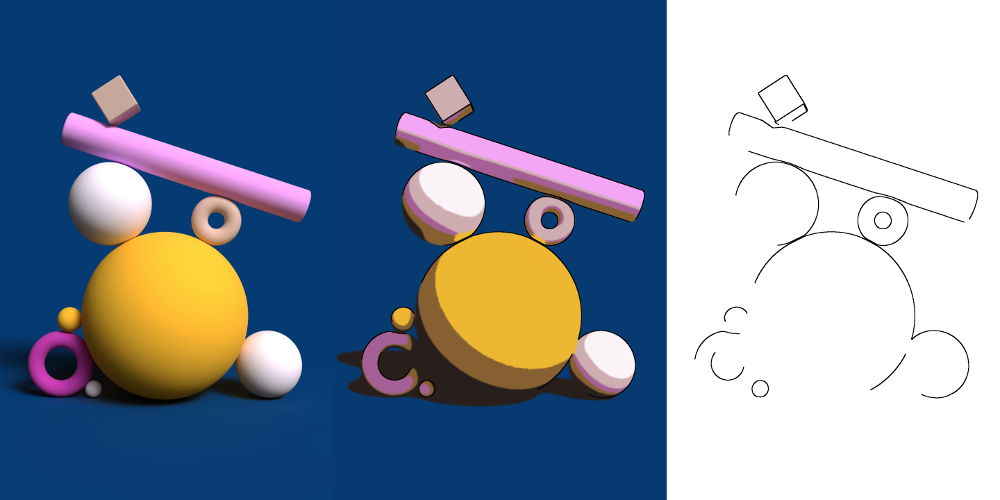
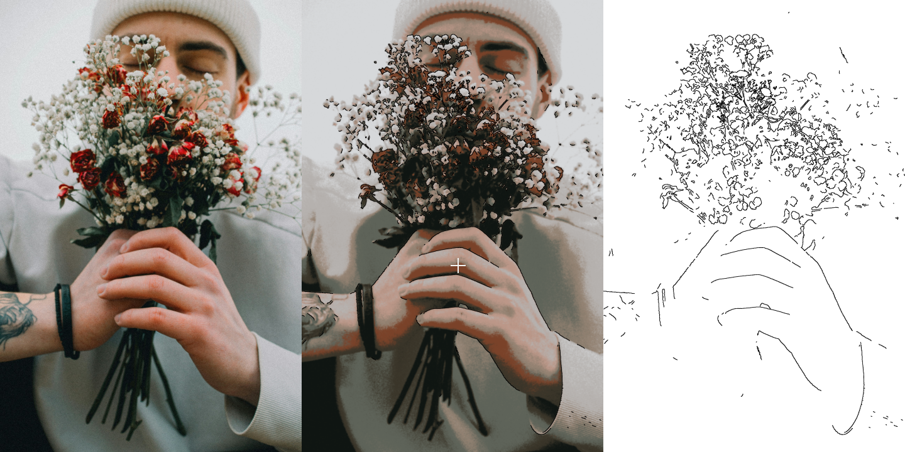
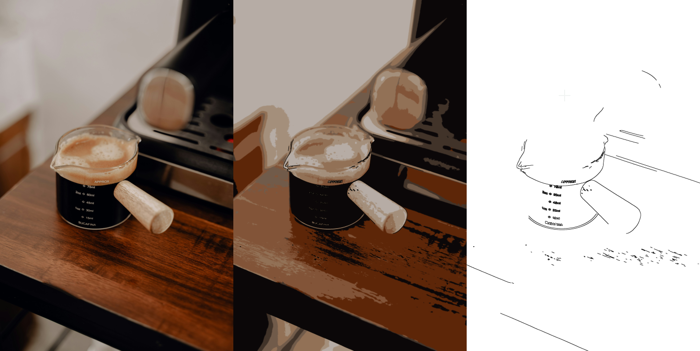
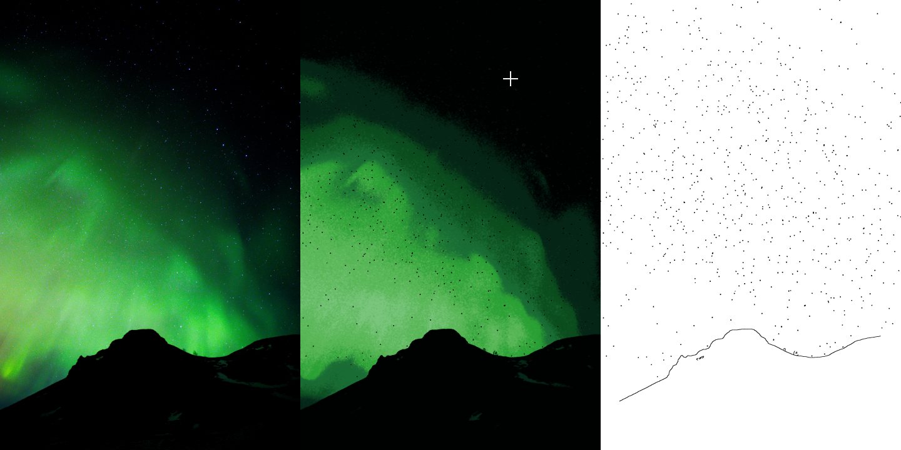
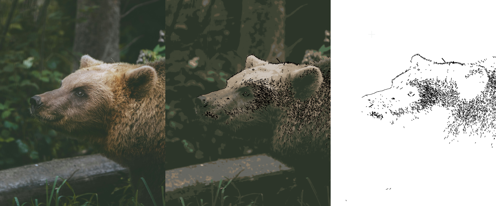

# Cartoonize

OpenCV와 Python을 이용한 이미지 만화화

## 기능

원본 이미지 / 만화화된 이미지 / 테두리 추출 결과물이 표시됩니다.
- `-` 이전 이미지
- `=` 다음 이미지

## 한계

색상을 k-means clustering 했기 때문에, 이미지에 다양한 색상이 있을수록 원본과 다른 색상을 내거나 부정확한 결과물을 냅니다.

또한, canny edge detection을 사용하기 때문에 별이나 털과 같이 밝기 변화가 심한 부분이 이미지에 포함되어 있을 경우, 명확한 결과물이 나오지 않습니다.

## 이미지 출처

Unsplash (https://unsplash.com). 작가와 자세한 정보는 images폴더의 파일 이름을 참조하세요.
